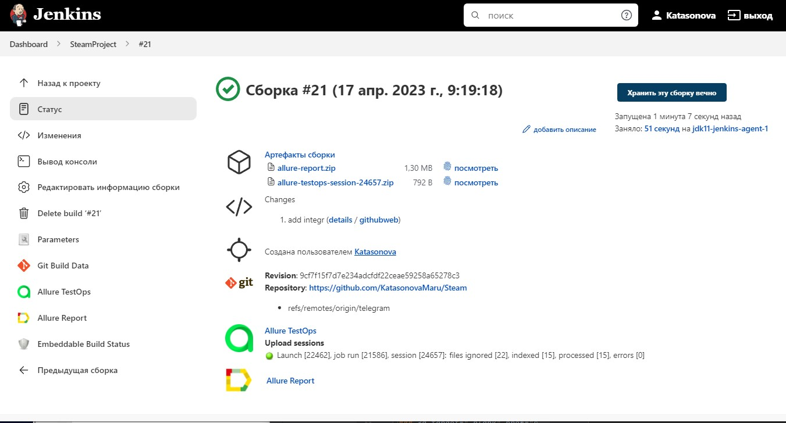
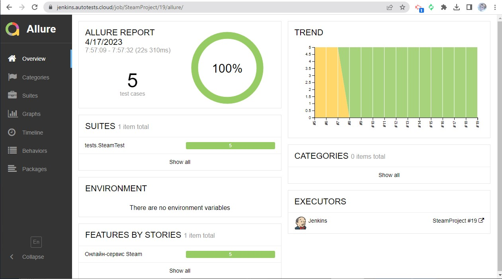
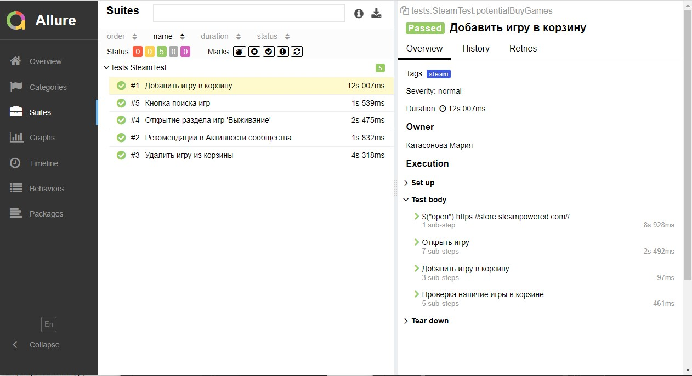
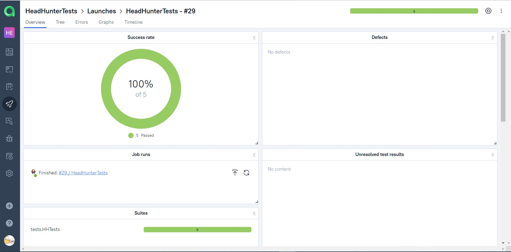
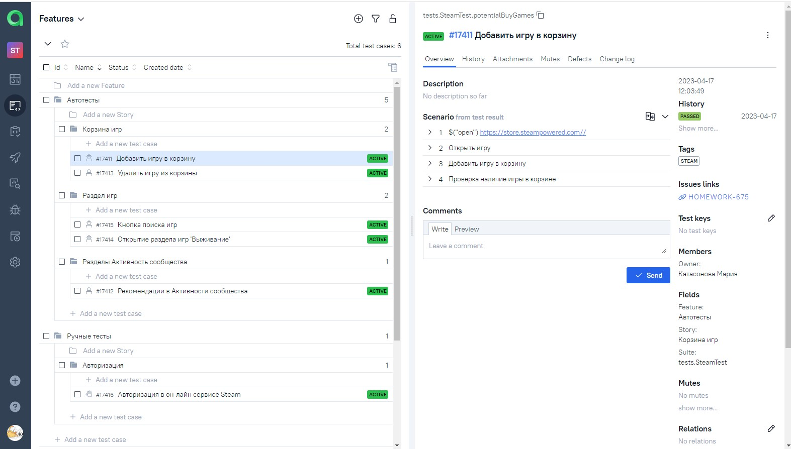
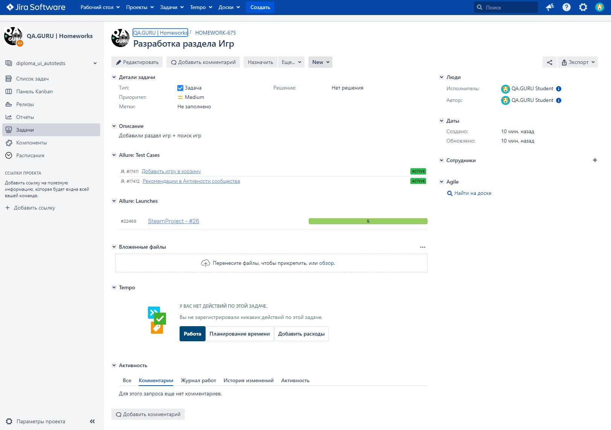
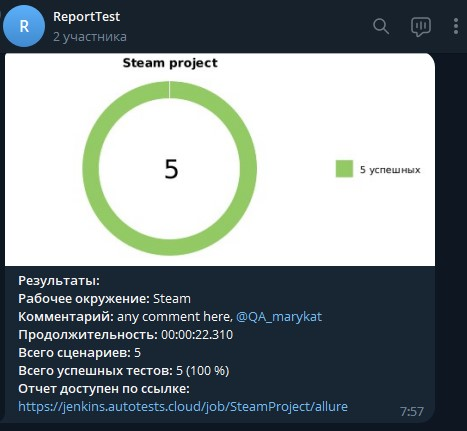

# UI, API и Mobile автотесты для сайта [STEAM](https://store.steampowered.com/)


# <a name="TableOfContents">Содержание страницы</a>
+ [:trophy: Инструменты и технологии](#ToolsAndTechnologies)
+ [Описаниe](#Description)

+ [Проект](#Project)
+ [:heavy_check_mark:  Реализованные проверки:](#ImplementedСhecks)
  - <a href="#cases-ui"> UI
  - <a href="#cases-api"> API
  - <a href="#cases-mobile"> Mobile
+ [👷‍♂️ Сборка в Jenkins](#Build_in_Jenkins)
+ [:clipboard: Параметры сборки в Jenkins:](#Build_Parameters_in_Jenkins)
+ [:computer: Запуск из терминала](#Launch_from_terminal)
  - <a href="#console-ui"> UI
  - <a href="#console-api"> API
  - <a href="#console-mobile"> Mobile
+ [:chart_with_downwards_trend: Allure отчет](#Allure_report)
  + [Главный экран отчета](#Allure_report1)
  + [Страница с проведенными тестами](#Allure_report2)
+ [:bar_chart: Интеграция с Allure TestOps](#Integration_Allure_TestOps)
    + [Экран с результатами запуска тестов](#Интеграция_с_Allure_TestOps1)
    + [Страница с тестами в TestOps](#Интеграция_с_Allure_TestOps2)
+ [:chart_with_upwards_trend: Интеграция с Jira](#Integration_Jira)
+ [Страница с задачей в Jira](#Page_Jira)
+ [:iphone: Отчет в Telegram](#Telegram)
+ [:movie_camera: Видео примеры прохождения тестов](#Video)

<a name="ToolsAndTechnologies"><h2>:trophy: Инструменты и технологии</h2></a>
<p  align="center">
  <a href="https://www.jetbrains.com/idea/"><code></code></a>
  <a href="https://www.java.com/"><code></code></a>
  <a href="https://selenide.org/"></a><code></code></a>
  <a href="https://aerokube.com/selenoid/"><code></code></a>
  <a href="https://gradle.org/"><code></code></a>
  <a href="https://junit.org/junit5/"><code></code></a>
  <a href="https://docs.qameta.io/allure/"><code></code></a>
  <a href="https://qameta.io/"><code></code></a>
  <a href="https://github.com/"><code></code></a>
  <a href="https://git-scm.com/"><code></code></a>
  <a href="https://www.jenkins.io/"><code></code></a>
  <a href="https://www.atlassian.com/ru/software/jira"><code></code></a>
  <a href="https://bitbucket.org/"><code></code></a>
  <a href="https://telegram.org/"><code></code></a>
</p>

<a name="Description"><h2>Описаниe</h2></a>
Автотесты в этом проекте написаны на `Java` с использованием `Selenide`.\
`Gradle` - для автоматической системы сборки.  \
`JUnit5` - для модульного тестирования.\
`Jenkins` - CI/CD для удаленного запуска тестов.\
`Selenoid` - для удаленного запуска браузеров в `Docker` контейнере.\
`Allure Report` - для визуализации результатов тестирования.\
`Telegram Bot` - для уведомлений о результатах тестирования.\
`Allure TestOps` - система управления тестированием.

<a name="Project"><h2>Проект</h2></a>
<a href="https://store.steampowered.com/"><code></code></a> Проект по автоматизации тестирования для Steam, — онлайн-сервис цифрового распространения компьютерных игр и программ :star2:

<a name="ImplementedСhecks"><h2>:heavy_check_mark:  Реализованные проверки:</h2></a>
<a id="cases-ui"></a>UI-кейсы:
:heavy_check_mark: Авторизация на сайте</br>

:heavy_check_mark: Наличия раздела игр из категории 'Выживание'</br>

:heavy_check_mark: Наличие рекомендаций в Активности сообщества</br>

:heavy_check_mark: Поиск игр</br>

:heavy_check_mark: Добавление игры в корзину</br>

:heavy_check_mark: Удаление игры из корзину</br>

<a id="cases-api"></a>API-кейсы:

:heavy_check_mark: Открытие раздела игр из категории 'Выживание'</br>

:heavy_check_mark: Поиск игр</br>

:heavy_check_mark: Добавление игры в корзину</br>

:heavy_check_mark: Проверка доступа</br>

<a id="cases-mobile"></a>Mobile-кейсы:

:heavy_check_mark: Авторизация в приложении</br>

:heavy_check_mark: Поиск игр</br>

:heavy_check_mark: Добавление игры в корзину</br>

:heavy_check_mark: Удаление игры из корзину</br>


<a name="Build_in_Jenkins" href="https://jenkins.autotests.cloud/job/SteamProject/"><h2>👷‍♂️ Сборка в Jenkins<h2></a>





<a name="Build_Parameters_in_Jenkins"><h2>:clipboard: Параметры сборки в Jenkins:</h2></a>

Сборка в Jenkins

- BROWSER (браузер, по умолчанию chrome)

- BROWSER_VERSION (версия браузера, по умолчанию 100.0)

- BROWSER_SIZE (размер окна браузера, по умолчанию 2500х1080)

- BASEURL (какой адрес открывать для запуска тестов)

- SELENOID_URL (где запускать тесты)

- TASK (с какими тегами запускать тесты)


<a name="Launch_from_terminal"><h2>:computer: Запуск из терминала</h2></a>
### <a id="console-ui"></a>Локальный запуск UI-тестов

```
gradle clean steamUI
```

### <a id="console-api"></a>Локальный запуск API-тестов

```

gradle clean steamApi

```

### <a id="console-mobile"></a>Локальный запуск Mobile-тестов

```

gradle clean steamMobile

``
Удаленный запуск:

```

clean
${TASK}
-Dbrowser=${BROWSER}
-Dbrowser_version=${BROWSER_VERSION}
-Dbrowser_size=${BROWSER_SIZE}
-Dbaseurl=${BASEURL}
-Dselenoid_url=${SELENOID_URL}
```
<a name="Allure_report"><h2>:chart_with_downwards_trend: Allure отчет</h2></a>

- <a name="Allure_report1"><h3>Главный экран отчета</h3></a>



-  <a name="Allure_report2"><h3>Страница с проведенными тестами</h3></a>



<a name="Integration_Allure_TestOps"><h2>:bar_chart: Интеграция с Allure TestOps</h2></a>

- <a name="Integration_Allure_TestOps1"><h3>Экран с результатами запуска тестов</h3></a>



- <a name="Integration_Allure_TestOps2"><h3>Страница с тестами в TestOps</h3></a>



 <a name="Integration_Jira"><h2>:chart_with_upwards_trend: Интеграция с Jira</h2></a>

- <a name="Page_Jira"><h3>Страница с задачей в Jira<h3></a>



<a name="Telegram"><h2>:iphone: Отчет в Telegram</h2></a>



<a name="Video"><h2>:movie_camera: Видео примеры прохождения тестов</h2></a>

https://user-images.githubusercontent.com/130640317/232434914-a22cc893-edd6-4bca-b6e3-ceeeea5fc83e.mp4

:heart: <a target="_blank" href="https://qa.guru">qa.guru</a><br/>

:blue_heart: <a target="_blank" href="https://t.me/qa_automation">t.me/qa_automation</a>


  

  
  

